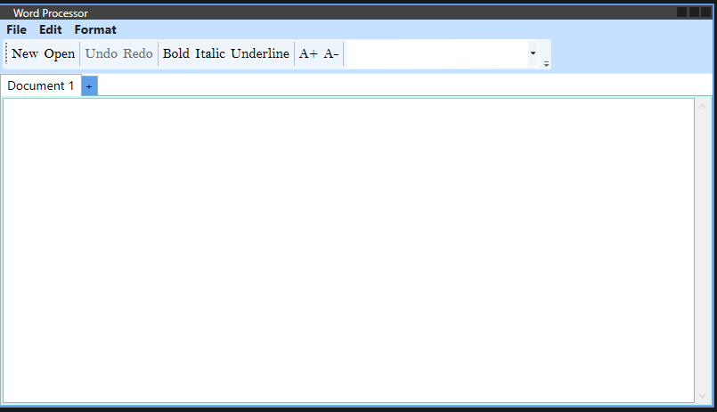

# Word Processor

A feature-rich Word Processor application built in C# with WPF. This application allows users to create, edit, and format text documents, and includes support for popular keyboard shortcuts. It also features multiple document tabs with scrollable content.

---

## Features

### General Features
- **Multiple Document Tabs**: Open multiple documents in separate tabs with the ability to close individual tabs.
- **Scrollable Content**: Automatically displays a vertical scroll bar when the document content exceeds the visible area.
- **Keyboard Shortcuts**: Full support for common `Ctrl` key shortcuts for efficient text editing.

### Text Formatting
- **Font Families**: Choose from system-installed font families.
- **Text Styling**: Apply bold, italic, and underline effects to selected text.
- **Font Size Adjustments**: Easily increase or decrease font size with toolbar buttons.

---

## Installation

1. Clone the repository:
   ```bash
   git clone https://github.com/Ati-i/word-processor.git
   cd word-processor
   ```

2. Open the solution file (`WordProcessor.sln`) in Visual Studio.

3. Restore dependencies and build the application:
   - Open the Solution Explorer in Visual Studio.
   - Right-click on the solution and select **Restore NuGet Packages**.
   - Build the solution by pressing `Ctrl + Shift + B`.

4. Run the application:
   - Press `F5` or click on **Start** in Visual Studio.

---

## Usage

### Creating a New Document
- Click on the **New** button in the toolbar, or press `Ctrl + N`.

### Opening an Existing Document
- Click on the **Open** button in the toolbar, or press `Ctrl + O`.
- Select a file from your system to open.

### Saving a Document
- Click on the **Save** button in the toolbar, or press `Ctrl + S`.
- If the file hasn't been saved before, a "Save As" dialog will appear.

### Formatting Text
- Use the toolbar buttons or keyboard shortcuts to apply formatting:
  - **Bold**: `Ctrl + B`
  - **Italic**: `Ctrl + I`
  - **Underline**: `Ctrl + U`

### Scrolling Through Content
- Scroll vertically through long documents using the built-in scroll bar.

---

## Screenshots

### Main Interface


### Multiple Tabs


---

## Contributing

Contributions are welcome! To contribute:
1. Fork the repository.
2. Create a new branch for your feature or bugfix:
   ```bash
   git checkout -b feature-name
   ```
3. Commit your changes and push the branch:
   ```bash
   git commit -m "Description of changes"
   git push origin feature-name
   ```
4. Open a Pull Request on GitHub.

---

## License

This project is licensed under the MIT License. See the [LICENSE](LICENSE) file for details.

---

## Acknowledgments

- **WPF Documentation**: For providing resources on building rich desktop applications.
- **Microsoft Visual Studio**: For developing and debugging the application.

---

## Contact

For any questions or feedback, please contact:
- **Author**: Ati-i
- **Email**: [ATIA_SUPERIOR@outlook.com](mailto:ATIA_SUPERIOR@outlook.com)
- **GitHub**: [Ati-i](https://github.com/Ati-i)
